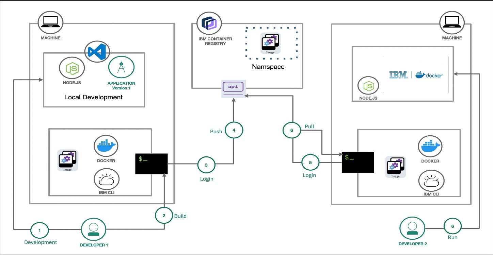

# Dockerize-with-IBM
In this tutorial, we will learn how containers are different from previous traditional architectures and how IBM container registry make our CI/CD lifecycle easier.

## Steps :
1. [History of different architectures before Docker Platform](#1-history-of-different-architectures-before-docker-platform)
2. [Docker Architecture](#2-docker-architecture)
3. [IBM Container Registry and Docker together](#3-IBM-Container-Registry-and-Docker-together)
4. [Demo](#4-demo)

## 1. History of different architectures before Docker Platform

Before going through these architecutre let me clear you all architectures practices are good and it totally depends on your infrastructure usecase.

### Traditional architecture  :
In early ages, there was a concept of physical servers and on top of it, there's OS  ofcourse to bootup the settings for us. Once our server is up we can deploy our applications there. Now, what's the constraint here?  There is no proper way to limit my resources. Example: Suppose I am running my "A" application after 5 years, I added a new "B" application to the same server. Now "A" application started receiving a lot of traffic due to this my complete server will slow down or even crash and all the other applications attached to it will be affected.  One solution for this would be, I can setup another server and deploy my new application there but trust me it would be really costly.

### Virtualized architecture:
Before going into the virtualized architecture let add here IBM has done the first virtualization in 1960 on System 370. How did it work? We have one physical server on the top of its OS and then installed "Hypervisor ". The hypervisor can be considered as a middleware defined software that takes all the resources from the physical server (CPU,RAM, FILESYSTEM) and helps in allocating to multiple virtual machines. For more about Hypervisors checkout( https://vapour-apps.com/what-is-hypervisor/). Now as compared to Traditional deployment, virtualized deployment has the power in resource allocation. What means by resource allocation? Now it's possible to create multiple VM's with different resource configurations with reducing hardware costs. Each VM will have its own OS and on top of it, there will be an application running. Example: Now I can run my "A" application on VM1 and "B" application on VM2, in the future if my application "A" goes down it will not affect my other applications nor my physical server as both apps are running on different VM's.

### Container architecture:
Containers are one of the latest approaches in which when we install a container platform it directly uses the host OS. Therefore, containers are considered lightweight because a container has its own filesystem, CPU, memory, process space, and more but no OS defined in it.  As they are decoupled from the underlying infrastructure, they are portable across clouds and OS distributions. Now we can run thousands of applications as containers without worrying about if some containers go down what happens? Within a second container can get up without causing any problems to other containers running.

## 2. Docker Architecture

Docker is an open platform for developing, shipping, and running applications. Docker enables you to separate your applications from your infrastructure so you can deliver software quickly. 

There are three main components in Docker Architecture :

__Docker Daemon :__
When the client install Docker, on the top of its OS and  docker daemon is installed and run directly within the host machine’s kernel which is actually responsible for all the major API calls between containers and registries.

__Client :__
Once Docker is initialized on the client's platform they have the power of three simple commands to control the complete development life cycle.
 1. Docker build:
 This will help us to execute the steps of how our application will execute, bypassing Dockerfile. The final result through this command will be a newly created 
 image(instructions for creating a Docker container)
 1. Docker pull:
 The image is already available on some registry, and you just need to pull that image on the local machine. 
 1. Docker run:
 Once the image is available on the local machine we can run the image as a container using the run command and can create as many containers of that image as  
 required.

__Image :__
An image is essentially built from the instructions and bind the complete resouces of an application which become executable version.

__Container :__
A container is a runnable instance of an image. We can create, start, stop, move, or delete a container using the Docker API.

__Registry :__ 
A Docker registry stores Docker images. Docker Hub is a public registry that anyone can use, and Docker is configured to look for images on Docker Hub by default. We can even run our own private registry like we will do in the tutorial using IBM registry.

## 3. IBM Container Registry and Docker together

## 4. Demo
### Pre-requisites:
1. Create IBM Cloud Account [Here](http://ibm.biz/dockerize)

2. Install docker on your local machine :
[Mac](https://docs.docker.com/docker-for-mac/install/)
[Windows](https://docs.docker.com/docker-for-windows/install/)

### Steps:
1. [Install IBM Cloud CLI](#1-install-ibm-cloud-cli)
2. [Lets Dockerize the application](#2-lets-dockerize-the-application)
3. [Log in to IBM Cloud](#3-log-in-to-ibm-cloud)
4. [Setup a Namespace](#4-setup-a-namespace)
5. [Push Docker image to your namespace](#5-push-docker-image-to-your-namespace)
6. [Pull and Run the image](#6-pull-and-run-the-image)

#### 1. Install IBM Cloud CLI
[Download](https://github.com/IBM-Cloud/ibm-cloud-cli-release/releases/)

#### 2. Lets Dockerize the application
1. Run command  `git clone https://github.com/mahsankhaan/dockerize-with-ibm.git`.   
2. Now change to the directory where you cloned the application, in my case: `muhammadahsankhana$ cd Downloads/dockerize-with-ibm/`
3. Once inside the directory check if you have all the files available. run command `ls`
4. There you can see DockerFile already created for you. Let's understand the docker file : 
 LINE 1: The first thing we need to do is define from what image we want to build from. As for our scenario, we're containerizing the Node app so we shall use an official Node image with the latest version.
 LINE 2: Next we create a directory to hold the application code inside the image. we are setting up `/app`
 LINE 3 & 4:  We will copy all our package files and bundle app's source code inside the Docker image.
 LINE 5:  Install Dependencies 
 LINE 6:  Expose port 3000 to the outside world once the container has launched.
LINE 7: Describes what should be executed first when the Docker image is launching.

5. Run command `docker build -t hello-world . ` to build a Docker image.
**NOTE : You have to be in the project where Dockerfile is available and don't forget to add  "." at the end of the command above **'

6. To verify the image is successfully created,  run command `docker images` There must be your image as hello-world.

#### 3. Log in to IBM Cloud 
 
1. Open your terminal and run the command `ibmcloud login`
2. Enter Email and Password of your IBM account that you setup while creating the account.
3. Once successfully login, you will able to see Authenticating...OK
4. If you have multiple accounts then kindly select your preferred account from the option. Example Muhammad Ahsan Khan's Account (ae4eed79ad174e76882b8e52f525b38e)
5. Now in Select a region section you can skip for now.

#### 4. Setup a namespace
1. Login in IBM container `ibmcloud cr login`
2. Target IBM Cloud Container Registry region:  `ibmcloud cr region-set us-south` 
3. Let's create a namespace in the above target region `ibmcloud cr namespace-add namespace-check`
   **NOTE:If you got FAILED error try to change the name of the namespace**
4. To ensure that your namespace is created `ibmcloud cr namespace-list`

#### 5. Push Docker image to your namespace

We have already created our namespace in step 4, now let's push our local image to IBM container registry namespace.

1. Run command `ibmcloud cr login`  to log into IBM Cloud Container Registry.
2. Now you must able to see **Logged in to 'us.icr.io'**. Same region we created before.
3. Run command `ibmcloud cr namespace` to see your namespace
4. Now tag the image that is on our local machine. Run `docker tag hello-world:latest us.icr.io/namespace_check/nodeapp:v1` **NOTE: This command can be different for you so be careful** "<region>.icr.io/<my_namespace>/<image_repo>:<tag>"
5. Check if the image is successfully tagged `docker images`
6. Run command `docker push us.icr.io/namespace_check/nodeapp:v1` to push our tagged image on IBM container registry namespace.
7. `ibmcloud cr images` to check if your image is successfully pushed
 
 
#### 6. Pull and Run the image

Now our image is available on IBM container registry, let's pull the image to our local machine and run it as a container.

1. To pull image run command `docker pull us.icr.io/namespace_check/nodeapp:v1` 
2. Now check if image is successfully pulled, `docker images`
3. Let's run image as container, `docker run -d -p 3000:3000 us.icr.io/namespace_check/nodeapp:v1 `

-d: Means detached, so that the terminal does not get stuck
-p: specifying the port that will be mapped to the container

4. Run command `docker container list` to check container is up and running. 
5. Open browser http://localhost:3000/ .
6. Stop the container `docker stop 195d61ece4b0` , stop by the container_id

